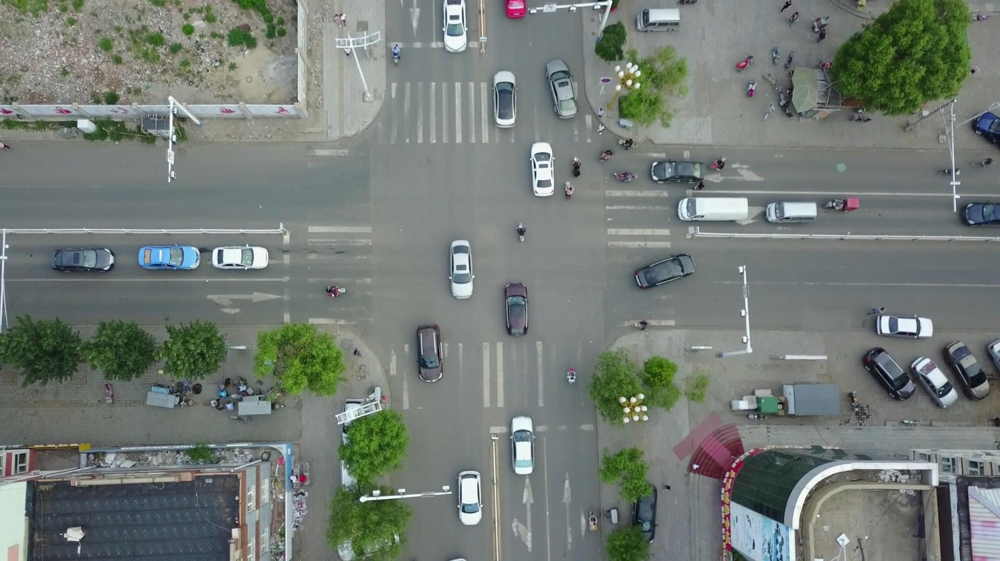

## Models trained with ultralytics framework:
### 1. RT-DETR L:
Download from the following link and put it in under models:
https://drive.google.com/file/d/1v8MLllwiHPgyPFujrn_5q4-jj7nln77P/view?usp=drive_link
### 2. Yolo11-m:
Download from the following link and put it in under models:
https://drive.google.com/file/d/1p8XjyBqHfXXQFjQHhIMbljrS_HNx9lqV/view?usp=sharing
### Test and run
Run inference from **inference/inference.ipynb**.

## Custom train RT-DETR v2
1. Clone the original RT-DETR repo from https://github.com/lyuwenyu/RT-DETR.git. We'll work with the subfolder rtdetrv2_pytorch. Its folder structure is as in this repo.
2. Download the trained rtdetrv2_small model and put it in **models** (under RT-DETR) https://github.com/lyuwenyu/storage/releases/download/v0.2/rtdetrv2_r18vd_120e_coco_rerun_48.1.pth. 
3. Download VisDrone train + validation data from https://github.com/VisDrone/VisDrone-Dataset.
Put them under RT-DETR/rtdetrv2_pytorch/dataset/visdrone/train and RT-DETR/rtdetrv2_pytorch/dataset/visdrone/val
4. Get json files in coco format by running **write_json.py** (This step is optional. I already run and put it in the folder)
5. Train with **finetune.py** which follows **optimizer.yaml** from the original paper.

**Remark:** I tried to replicate the training regime using hyper-parameters from the original paper. However, it seems not optimal because the datasets are different.

### Output by RTDETR
Below is an example on input image and output by RT-DETR

